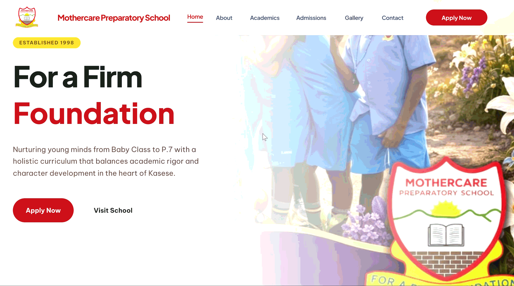

# MothercarePrepSchool
Modern, responsive website for Mothercare Preparatory School (Kasese, Uganda), designed to showcase academics, admissions, and student life. Open-source and ready for customization.



project is deployed on vercel for testing purposes:

---

# Contributing Guide

Thank you for your interest in contributing to the Mothercare Preparatory School website project! This project is open-source and welcomes contributions aimed at improving design, functionality, performance, and overall user experience.

## Project Overview

This project is a modern, responsive website built for Mothercare Preparatory School located in Kasese, Uganda. It is designed to present the school’s academic structure, admissions process, and student life in a professional and engaging way.

##  Tech Stack & Libraries

This project leverages modern web development tools for a fast, scalable, and developer-friendly experience.

* **Core Framework:** React
* **Build Tool:** Vite
* **Language:** TypeScript
* **Styling:** Tailwind CSS
* **Routing:** React Router
* **UI Components:** Custom accessible components (Shadcn UI style)

## 📁 Folder Structure

Here is a quick overview of how the repository is organized to help you navigate the codebase:

```text
MothercarePrepSchool/
├── public/                 # Static assets that bypass the build process
├── repo_attachement/       # Documentation images (GIFs, mockups)
├── src/                    # Main source code
│   ├── assets/             # Images and media used within components
│   ├── components/         # Reusable React components
│   │   ├── layout/         # Structural components (Header, Footer, Page Layout)
│   │   └── ui/             # Base UI elements (Buttons, Cards, Inputs, Modals)
│   ├── pages/              # Main route views (Home, About, Admissions, etc.)
│   ├── styles/             # Global CSS and theme configurations
│   ├── App.tsx             # Main application wrapper
│   ├── main.tsx            # React DOM entry point
│   └── routes.tsx          # Application routing setup
├── package.json            # Project dependencies and scripts
├── tailwind.config.js      # Tailwind CSS configuration
├── tsconfig.json           # TypeScript rules
└── vite.config.ts          # Vite build configuration
```
## Design Reference (Figma)
All contributors are encouraged to review the official design mockups and follow the prototype flow before making changes.

**[View the Figma Design Mockups](https://www.figma.com/design/mOjPcCJUpAy2SLtOlGLULs/Mothercare-Prep-School?node-id=0-1&t=deXSp22qqtmw2bwO-1)**


**[View the Interactive Prototype](https://www.figma.com/proto/mOjPcCJUpAy2SLtOlGLULs/Mothercare-Prep-School?node-id=9-3274&t=7iQbBiFQH0eehNAl-1&scaling=min-zoom&content-scaling=fixed&page-id=6%3A2381&starting-point-node-id=9%3A3274)**


## Design Flow
The design process starts from the prototype and flows as follows:

Review the full design mockups and prototype in Figma

Understand layout structure and navigation

Identify components (Navbar, Hero, Sections, Footer)

Break down UI into reusable components

Implement components in the codebase

Ensure responsiveness across devices

Maintain consistency with colors, fonts, and spacing

Note: Contributors should aim to match the design as closely as possible unless proposing an intentional improvement.

## Getting Started
1. Fork the Repository
Click the "Fork" button at the top right of the repository page to create a copy in your GitHub account:
```
https://github.com/MfrankUg/MothercarePrepSchool
```

2. Clone Your Fork
Open your terminal and clone the repository to your local machine, then navigate into the project folder:

Bash
```
git clone https://github.com/YOUR-USERNAME/MothercarePrepSchool.git
```

```
cd MothercarePrepSchool
```

3. Install Dependencies
Since this is a Vite project, install the required packages using npm or yarn:

Bash
```
npm install
```

## or
```
yarn install
```

4. Create a New Branch
Create a separate branch for your feature or bug fix:

Bash
```
git checkout -b feature/your-feature-name
```

5. Run the Development Server
Start the local development server to preview your changes:

Bash
```
npm run dev
```
## or
```
yarn dev
```
Open http://localhost:5173 with your browser to see the site. (Note: Vite defaults to port 5173)

6. Commit and Push Your Changes
Once you are happy with your work, commit your changes and push them to your forked repository:

Bash
```
git add .
git commit -m "Add: description of your changes"
git push origin feature/your-feature-name
```

7. Submit a Pull Request
Go to the original MfrankUg/MothercarePrepSchool repository on GitHub and click "Compare & pull request". Provide a clear description of what you changed or fixed.

Copyright © 2026 . All rights reserved.
